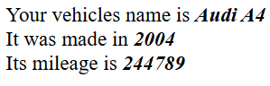

# This is a PHP OOP test:exclamation:

This isn't any significant project. These files are basically 2 methods in a class. Do as you wish with this information.

# How do I use this project?:cd:

 - You **pass the parameters to the constructor method** when you are creating a new object.

 - *And thats it.* You can customize the files to your own liking.

# Where can I learn Object-Oriented PHP?:elephant:
 - **For people who are new to PHP**:
    <https://www.w3schools.com/php/php_oop_what_is.asp>

# An example of what the code does
This is an example of what the code does


```PHP
class Vehicle {

        public $name;
        public $year;
        public $mileage; 

        public function __construct($name, $year, $mileage)
        {
            $this->name = $name;
            $this->year = $year;
            $this->mileage = $mileage;
        }

        public function info () {
            echo "Your vehicles name is <b><i>" . $this->name . "</b></i><br>";
            echo "It was made in <b><i>" . $this->year . "</b></i><br>";
            echo "Its mileage is <b><i>" . $this->mileage . "</b></i><br>";
        }

    }
```
